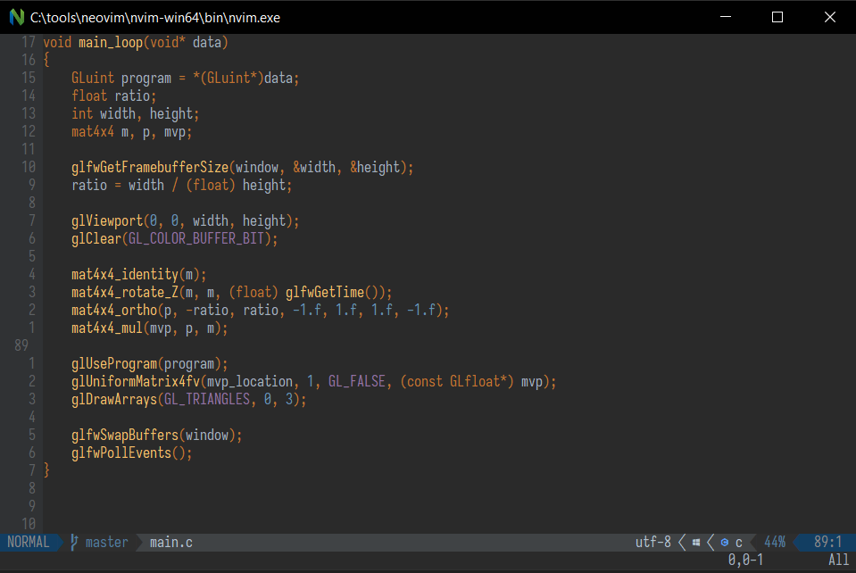

# Introduction

This is my personal neovim configuration. 



## Goals

* Easy to setup
* Lightweight, few dependencies, keep vim lightning fast
* All features needed for any file editing and C/C++ development
  * It does NOT try to be an IDE. Use RemedyBG as a debugger, use RenderDoc to debug graphics, use your terminal for everything else.
  * If you really need an IDE, JetBrains support for Vim keybindings (and even plugins, vimscript etc!) is amazing. I use it for python

# Installation

* Install neovim, I used chocolatey, installed v0.9.1, newer will probably work, but best to keep it the same
* You may need python3 installed. Not sure, I already had it.
* Optional: Install a patched NerfFont, I'm using Iosevka (https://github.com/ryanoasis/nerd-fonts/tree/master/patched-fonts/IosevkaTerm)
    * This is for icons to work, you can skip it. If you want to use it, change your terminal to use that new font
* git clone this repo into  "$env:LOCALAPPDATA\nvim"
    * This stores your local config files there. Feel free to remove .git directory and make it your own to easily store your personal preferences, and just treat this as a starting point
* from powershell: git clone https://github.com/wbthomason/packer.nvim "$env:LOCALAPPDATA\nvim-data\site\pack\packer\start\packer.nvim"
    * This installs Packer - a package manager for vim
* Install ctags (e.g. via chocolatey) - I used exuberant ctags but looks like Universal-ctags is a better, newer fork of this.
    * This is for "go to definition" functionality. Alternatively you can use LSP but I found it extraordinarly hard to setup on Windows (and it's kinda sluggish anyway)
* Run nvim, call:
```
:PackerSync
```
* Restart nvim, this time RUNNING FROM *VS x64 PROMPT* (it was crashing for me if compiled using mingw... I disabled it in config now though so it should be looking for cl.exe only anyways)
	treesitter will compile its stuff - this may take a while

# Plugins

## Packer

Plugin manager. Run *:PackerSync* to download plugins from github. All are listed in packer.lua

## Telescope

Navigate files

* space+ff - find files under current directory (grep file names)
* space+fg - find IN files under current directory (grep file contents)
* space+fp - find IN files checked with git (grep file contents)
* space+fs - find spelling (fix spelling/suggest a word)
* space+ft - find tag (see gutentags below)

## Harpoon

Navigate files you care about

* space+a - add file to harpoon list
* ctrl+e - explore harpoon list (you can move things around and remove the usual vim way)
* ctrl+j and ctrl+k - jump to next/prev item in the list (without opening menu with ctrl+e)

## Darcula

Theme. I like it. It's nice.

## Treesitter

Generates AST for whatever you're working on. This allows it to do syntax highlighting. Some other plugins also make use of it.

It needs a C++ compiler to install new language parsers. I configured it so it works with cl.exe only (msvc). Needs to run from developer command prompt (x64).

### Treesitter-context

Shows current scope at the top of the file if you scrolled past it. 
E.g. if you're inside a function and an if statement, and both are so large you scrolled past them (but your cursor is inside), you will see them both on top of your screen (with correct line numbers, so you can easily jump there).

### Treesitter-refactor

Highlight usages of current symbol and smart rename (within current file).

## Undotree

Press space+u to open a tree with history of changes to the current file. Scroll through it, it will automatically show changes from that revision. 
At any point you can start editing given revision, this will make a branch in the undo tree.

Remember to clean history files from time to time, it will porbably take a lot of space.

This is also configured to replace usual swap files in vim (just check undo tree if your computer crashed before you saved).

## Fugitive

Git integration.

Type ":Git <command>" to execute any regular git command. Works just like on commandline with some improvements for working in vim.


Alternatively type space-gs (or ":Git" without any command) to open a summary window with changes, unpushed commits etc.
Press g? to see possible commands.


## Devicons

Needs patched nerdfont - allows using icons.

## Gutentags

Automatically calls ctags when file is edited/created etc. 
Ctags is a separate program, necessary for udnerstanding language syntax. Vim can natively navigate tags it finds in a file called "tags" in your current working directory.

It is a bit limited compared to modern IDEs. You might want to use LSP but it's tricky to configure for me on Windows (for C, other languages should be dead easy).

To use those tags, just hover over definition and type "g]" (I tried remapping it, but doesnt seem to work the same?) (in normal mode) to go to definition. Then "ctrl-T" to go back.
Tags are stored on a stack, so you can go few levels deep, then go all the way back.

BTW. This is MUCH better than Visual Studio. And much much MUCH faster.

## Supertab

Autocompletion (using ctags above but also spelling fixes or just other words it finds in current file). 
Just press tab.
Can be configured to suit your needs.

## Ouroboros

space+h to switch between header/cpp files. Will ask to create one if it doesn't exist. 

Looks everywhere under current working directory. Matches exact name with a different extension only.
It can be a bit slow in large projects because of that :< But use it just once to find the file, then save file in harpoon and you can keep switching quickly.

## Lualine

Tabline at the bottom. Theme is separate from the one defined by darcula (but lualine tries to match it by default).

Should be easy to customise.

# TODO

* Add custom build/debug commands which will work with both vylib, custom build.bat and running a debugger (again, either remedybg or visual studio, depending on project? too much?)
* Lock in plugin versions

## Future/Maybe?

* Improve autocompletion, look into omnicompletion etc. Right now it's kinda basic? Maybe good enough
* Look more into fugitive, looks like there's a learning curve but it should pay off. (also stuff like https://dpwright.com/posts/2018/04/06/graphical-log-with-vimfugitive/)
* Formatting with (e.g. with https://github.com/sbdchd/neoformat and clang-format...) - not sure if I really need it

